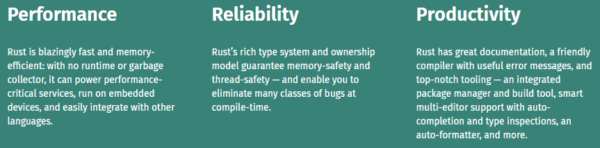

# Pemrograman Rust
Langkah awal memulai belajar bahasa pemrograman rust yaitu menginstall terlebih dahulu Rust. dengan mengklik [Link berikut](https://www.rust-lang.org/tools/install), dan nanti akan muncul halaman dimana kamu harus mengunduh file *rustup-init.exe* dan ikuti prosesnya dan jika penasaran dengan proses instalasi nya kamu bisa melihat di link berikut ini. [proses installasi rust di windows](docs/proses-install-windows.md)  

Kenapa Memilih belajar Rust ?  
Kita bisa melihat gambar dibawah ini ada 3 point penting yaitu (performance, reliability, productivity).

 *source: rust-lang.org*  

# Praktek
1. [Membuat Hello World](docs/hello-world.md)