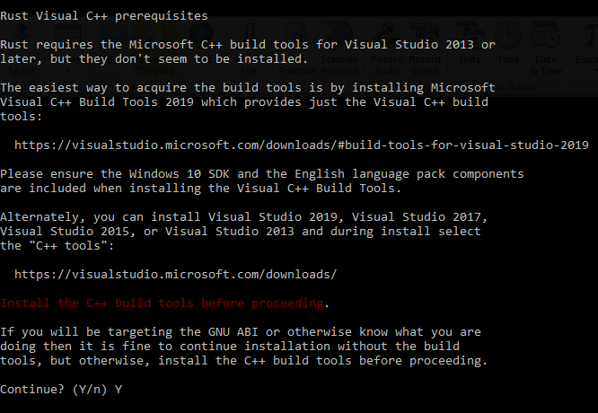
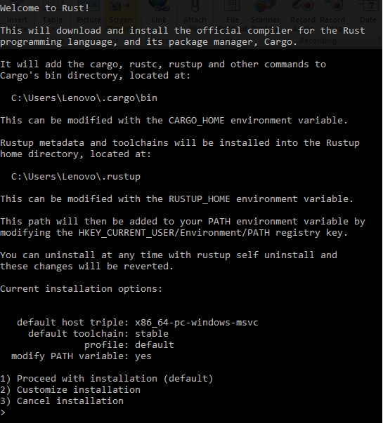
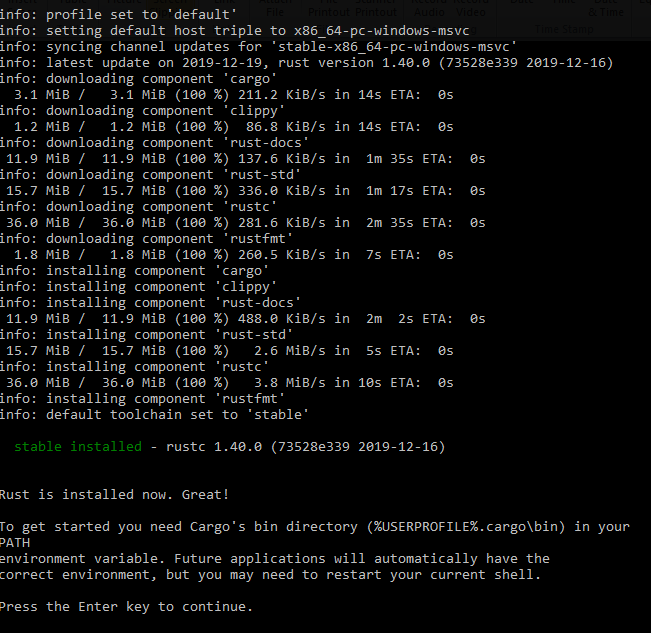

# Proses Installasi Rust Di Windows
Setelah kamu mengunduh file *rustup-init.exe* selanjutnya jalankan file tersebut dan kamu akan diarahkan ke halaman berikut ini.  

  
*source: rust install di windows*  

Anda diminta untuk mengikuti prasyarat dimana dikomputer anda harus terinstall ***Microsoft C++ build*** yang biasanya sudah include jika kamu menginstall IDE Visual Studio Code.
untuk menginstall *visual c++ build tools* nya secara terpisah kamu bisa mengunduh file nya [disini](https://visualstudio.microsoft.com/thank-you-downloading-visual-studio/?sku=BuildTools&rel=16) dan pilih menu *c++ build tools* dan lakukan proses install.   

> *Noted: pastikan kamu sudah menginstall Visual C++ Build Tools*

  
*source: rust install di windows*  

Kalian akan disajikan 3 pilihan menu dimana pilihan pertama kamu akan menginstall secara default tanpa ada modifikasi, sedangkan untuk pilihan kedua kamu akan menginstall dengan meng kostumasi nya sendiri dan pilihan ketiga adalah membatalkan proses installasi.   

  
*source: rust install di windows*   

Dan ini adalah proses installasi nya, di gambar nya akan memberikan informasi terkait progress downloading component rust ke komputer kamu. dan jika proses installasi sukses maka akan muncul informasi bahwa ***Rust is installed now. Great!***