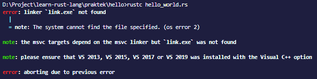

# Troubleshooting
  
*source: terminal*  

Jika kamu menemukan error seperti diatas ketika kamu melakukan compile di terminal, baik itu menggunakan perintah *rustc* atau *cargo* berikut adalah referensi untuk memperbaiki error tersebut:  

1. Stackoverflow : [Unable to compile Rust hello world on Windows: linker link.exe not found](https://stackoverflow.com/questions/55603111/unable-to-compile-rust-hello-world-on-windows-linker-link-exe-not-found)

----------
